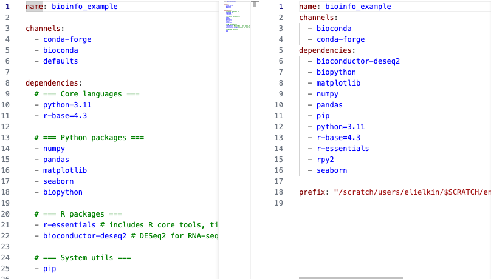
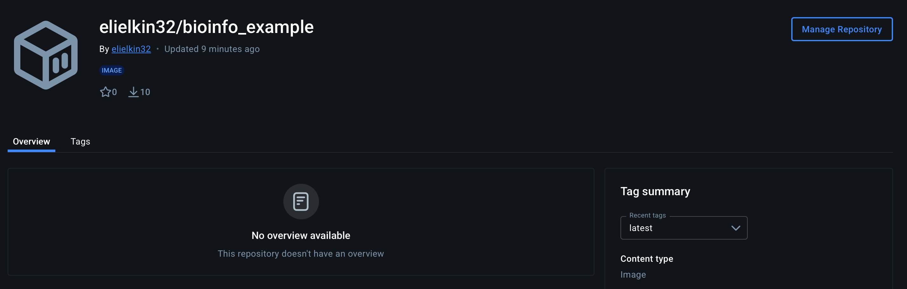

# Write-up 0: 


**Name:** Eliel Akinbami  
**Student ID:** elielkin  
**Date:** 12/10/2025  

---

## Overview  
> This document outlines steps I took for working with micromamba and docker.  

---

## Micromamba Content

### Contents of yaml file
- **name** - This is the name of the micro-conda environment that will be created 
- **channels** - These are the different package repositories that will be searched in order to download and install the executable files for the dependencies and packages listed below
- **dependencies** - Packages with their specific version that will be installed 

### Micromamba related Images.
#### **Activated environment**


#### **Results of python_example.py**


### New yaml file

#### **Differences between yaml files**


- The new file is stripped of the additional comments and white spaces present in the original file
- Rpy2 package is added to the list of packages needed for this environment
- Everything is arranged in alphabetical order
- The ***defaults channel*** is not present in the new one, because it was not used in downloading and installing any of the packages needed for this environment
- There is a prefix tab, showing the location where the environment is installed on my local computer


### Questions
1. ```python
    micromamba list env 
    ```
2. ```python
    micromamba activate "specific package", micromamba list
    ```
3. ```python
    micromamba remove packagename or micromamba remove -n myenv packagename
    ```
4. ```python
    micromamba install packagename -c channelname
    ```
5. ```python
    micromamba remove -n bioinfo_example --all
    ```
6. ```python
    micromamba list | grep -E "Bioconductor|r-base"
    ```
    There are **2** r-base packages (***r-base*** and ***r-base64enc***) and **0** Bioconductor packages 

## Container Content

#### ***Docker Hub image***


- Singularity could not open the file because the python file exists locally and the local path is not mounted on to the built container


